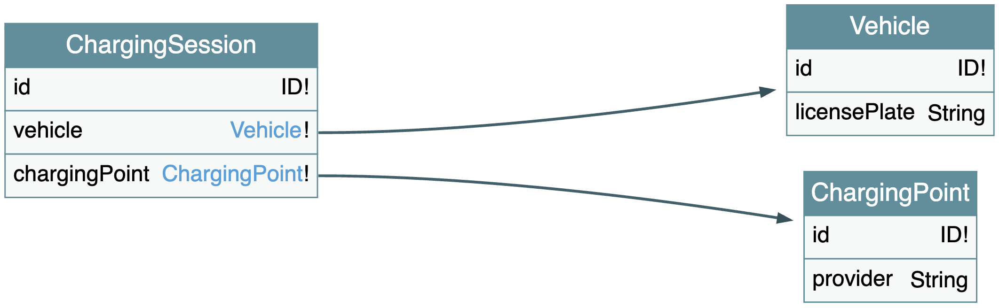

# S2DM EV Charging Demo Data Model

Welcome to the **EV Charging Demo Data Model**! 
This repository is an example of a data modeling project that follows the [**Simplified Semantic Data Modeling (S2DM)**](https://github.com/COVESA/s2dm) approach.

This project focuses on the Electric Vehicle (EV) charging domain, and is part of a demonstration split into two repositories:
* **S2DM EV Charging Demo Data Model (This repository)** - `Conceptual/Logical` layer. The data model that serves as a cannonical reference that could be used by multiple downstream systems.
* **[S2DM EV Charging Demo App](https://github.com/COVESA/s2dm-example-charging-session-app)** - `Physical` layer. The implementation of one example system/app that uses the cannonical data model as a reference.

This separation of concerns is inspired by the principles of a data-centric architecture.

## Data model
The data model of this fictional EV Charging domain is modulary split into multiple files inside the [`spec/`](/spec/) directory.
The models are authored with the [Schema Definition Language (SDL)](), which is the standard language of the [GraphQL](www.graphql.org) ecosystem.
> [S2DM](https://github.com/COVESA/s2dm) adopts SDL as authoring language for a cannonical data model and not necessarily for an API specification.

In an EV charging domain model we could find relevant types, such as `Vehicle` or `ChargingSession`, and their assotiated data structures. 
For example, the following snippet represents a basic structure for a `ChargingSession`, which is the main concept in our example domain.
```graphql
type ChargingSession {
  id: ID!
  label: String
  vehicle: Vehicle!
  chargingPoint: ChargingPoint!
}
```
Notice how the fields inside `ChargingSession` can resolve to either..
* ..an scalar (i.e., a particular datatype), such as `label: String`
* ..another type, such as `vehicle: Vehicle`

So, to make our basic example complete, let us also look at the types `Vehicle` and `ChargingPoint`:
```graphql
type Vehicle {
  id: ID!
  licensePlate: String
}
```
```graphql
type ChargingPoint {
  id: ID!
  provider: String
}
```

## Validation and composition
While modularity across multiple files allows us to focus on small concrete parts of the domain, they must be consistent.
For example, there cannot be references to types that have not been specified.
That is when S2DM comes into play because it helps us with core functions like:
* **Validation** - Am I using the proper syntax?
* **Check** - Am I applying the S2DM rules correctly?
* **Compose** - Can I create a coherent, valid output from my modular files?
* Etc.

Considering the basic model decribed before, we could compose it into one file as follows:

```shell
s2dm compose -s /spec -o composed.graphql
```

This command will result in the following:
```graphql
type Vehicle {
  id: ID!
  licensePlate: String
}

type ChargingSession {
  id: ID!
  vehicle: Vehicle!
  chargingPoint: ChargingPoint!
}

type ChargingPoint {
  id: ID!
  provider: String
}

type Query {
  ping: String
}
```

This is already a valid SDL schema that could be used in any existing GraphQL tool.
For instance, one can visualize this model with [GraphQL Voyager](https://github.com/APIs-guru/graphql-voyager), obtaining a graph like the following:


As we have not yet specified any `Query` type in our example until now, a dummy query was introduced by the tools to fulfill the GraphQL rule that it must exist at least one query.
A query refers to a `READ` operation.
In other words, it declares what is possible to retrieve from our data.
S2DM also leaverages queries as an entry point for making an arbitrary selection.
This and other features could be consulted in the [S2DM documentation](https://github.com/COVESA/s2dm).

## Exports
Databases, apps, or systems in the `physical` layer require a certain schema to structure how the data is persisted.
In our example, the data of the EV charging domain is stored using a No-SQL Document database.
For that, one could transform the cannonical data model written in SDL into the concrete artifact that is needed.

A few of such transformations are also supported by S2DM.
For example, we export the model into json schemas that are compatible with [MongoDB](https://www.mongodb.com/) as follows:

```shell
s2dm export mongodb -s spec/ -o json-schemas
```

This command creates a stand-alone schema for each top level type in our model.
For instance, the `ChargingSession` type is exported into:
```json
{
  "bsonType": "object",
  "properties": {
    "id": {
      "bsonType": "objectId"
    },
    "vehicle": {
      "bsonType": "object",
      "properties": {
        "id": {
          "bsonType": "objectId"
        },
        "licensePlate": {
          "bsonType": [
            "string",
            "null"
          ]
        }
      },
      "additionalProperties": true,
      "required": [
        "id"
      ]
    },
    "chargingPoint": {
      "bsonType": "object",
      "properties": {
        "id": {
          "bsonType": "objectId"
        },
        "provider": {
          "bsonType": [
            "string",
            "null"
          ]
        }
      },
      "additionalProperties": true,
      "required": [
        "id"
      ]
    }
  },
  "additionalProperties": true,
  "required": [
    "id",
    "vehicle",
    "chargingPoint"
  ]
}
```

## Releases
As S2DM is a method envisioned to be applied in modeling projects managed in GIT, one can create releases and automated [Continuous Integration (CI)](https://en.wikipedia.org/wiki/Continuous_integration) flows to support the governance and evolution of the model.
In this way, the maintainer can decide to release an inmutable set of artifact with every significant snapshot of the model.

Visit the releases space of this repository for examples.